= Autogenerated Logger Report

== By Location

Locations: 

(:ThMuCH2Sh02PairTall :ThMuOutsideWasp :ThMuCH2Sh02WhiteLoner :ThMuCh0ConjoinedBottom :ThMuCh2Sh01Thumb :ThMuOutsideDrone :ThMuCh2Sh01BrownTop :ThMuCh1LongLizard)

image::out/ThMuCH2Sh02PairTall.svg[]
image::out/ThMuOutsideWasp.svg[]
image::out/ThMuCH2Sh02WhiteLoner.svg[]
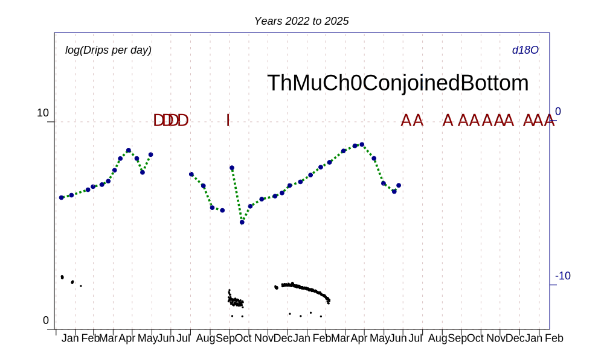
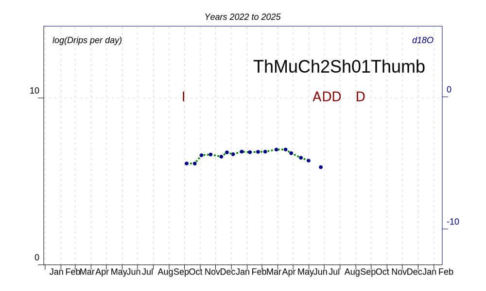
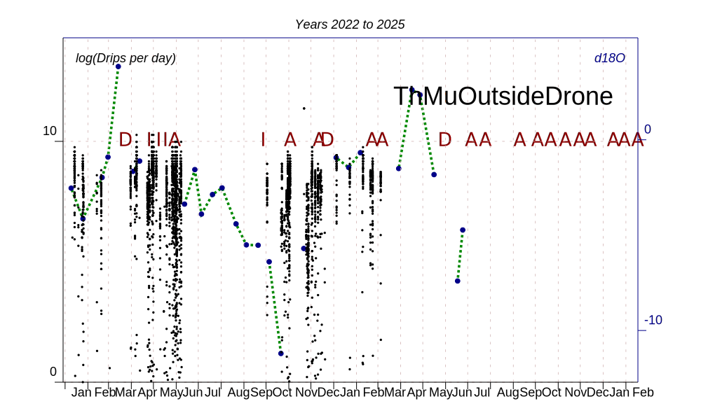
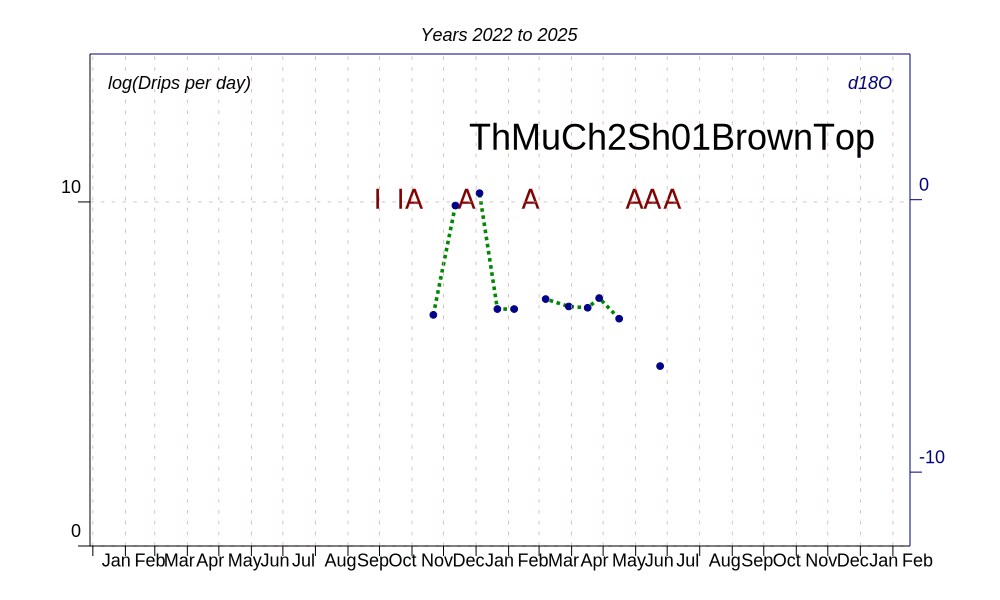
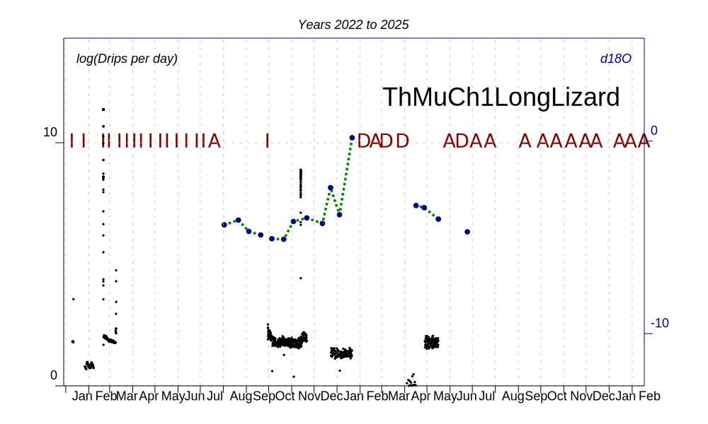

== By Logger

Loggers: 

#{:R08 :R15 :MTECH4 :R06 :R16 :NONE :FR6 :R05 :R12 :R20 :R11 :FR1 :R14 :MTECH2 :MTECH1 :nil :FR4 :FR5 :R10 :FR3 :R13 :R09 :FR2 :R19 :MTECH3 :R02 :R07 :R04 :R03 :R01}

image::out/R08.svg[]
image::out/R15.svg[]
image::out/MTECH4.svg[]
image::out/R06.svg[]
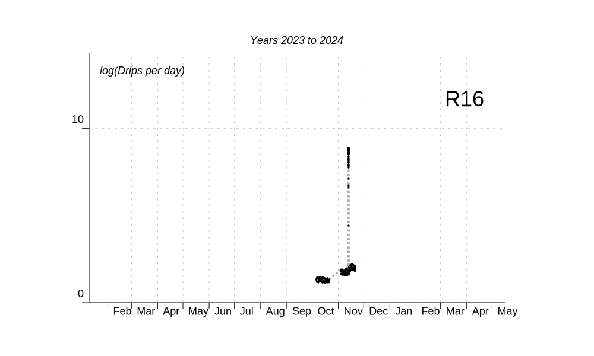
image::out/NONE.svg[]
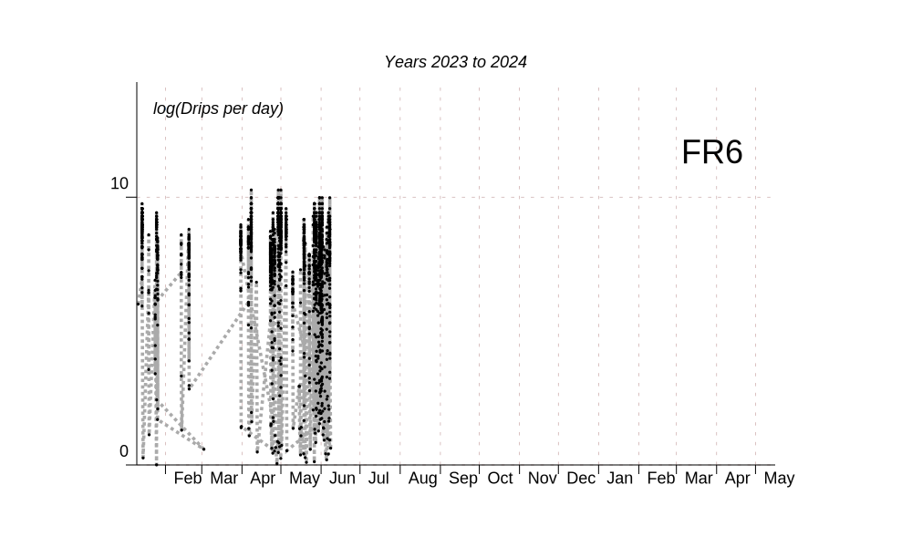
image::out/R05.svg[]
image::out/R12.svg[]
image::out/R20.svg[]
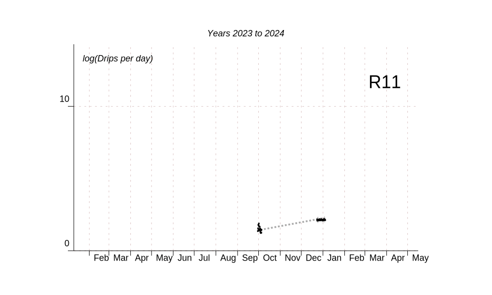
image::out/FR1.svg[]
image::out/R14.svg[]
image::out/MTECH2.svg[]
image::out/MTECH1.svg[]
image::out/nil.svg[]
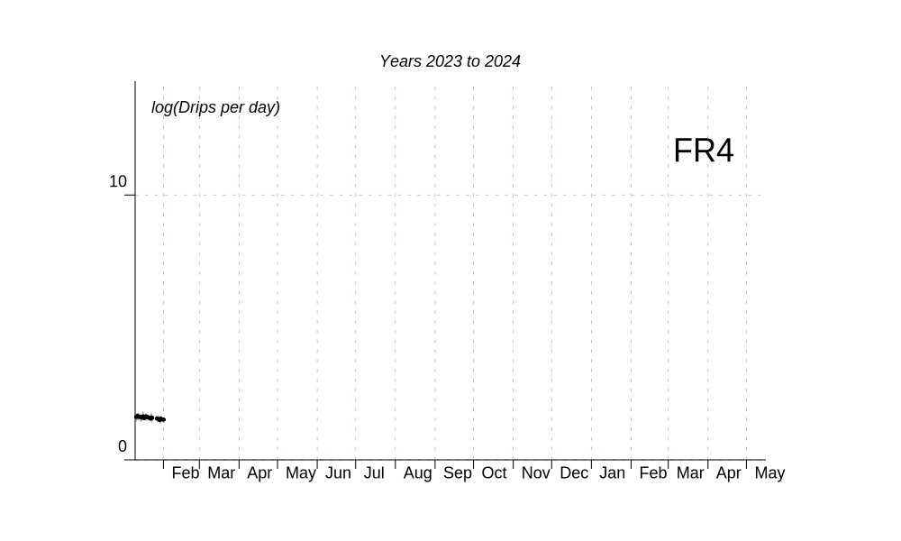
image::out/FR5.svg[]
image::out/R10.svg[]
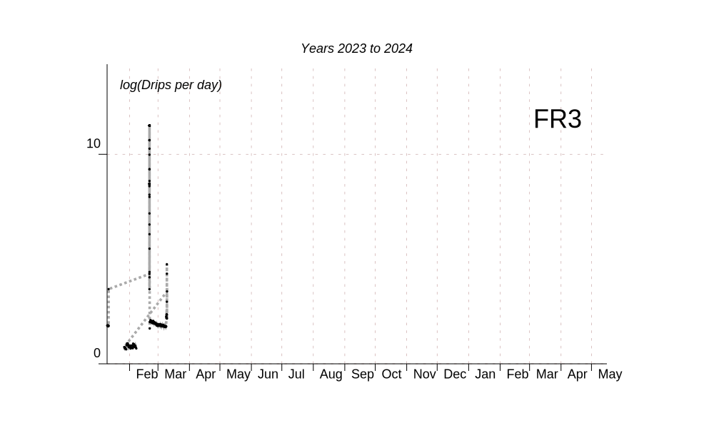
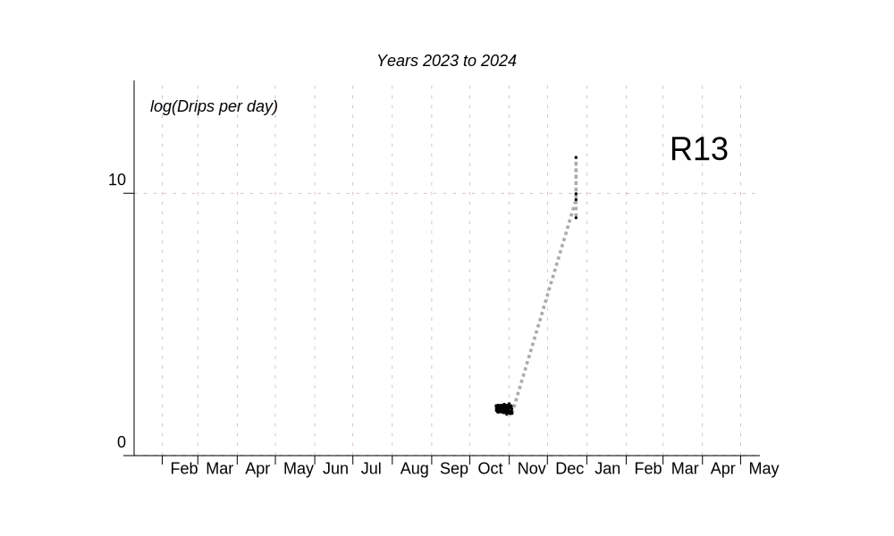
image::out/R09.svg[]
image::out/FR2.svg[]
image::out/R19.svg[]
image::out/MTECH3.svg[]
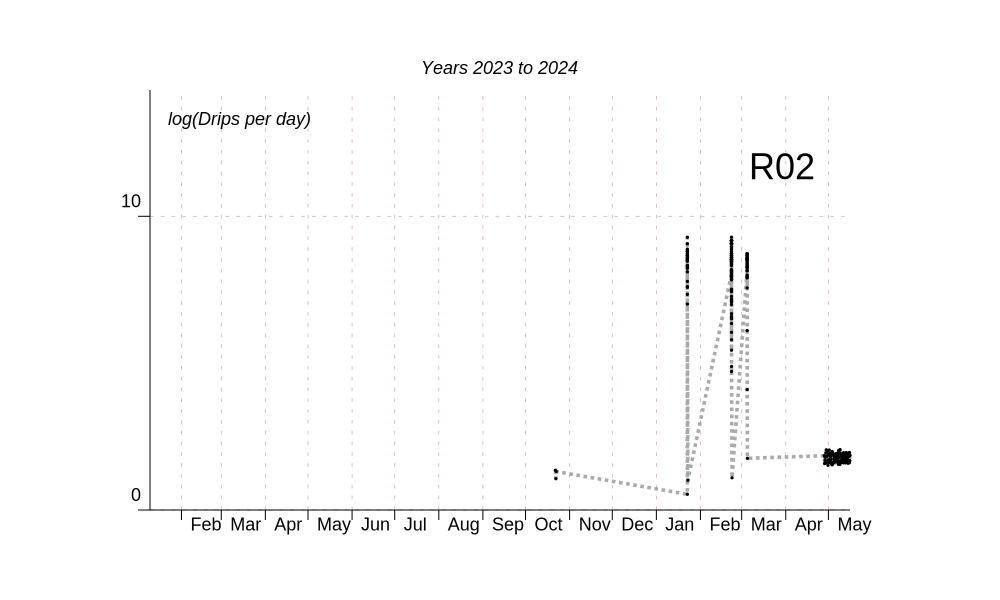
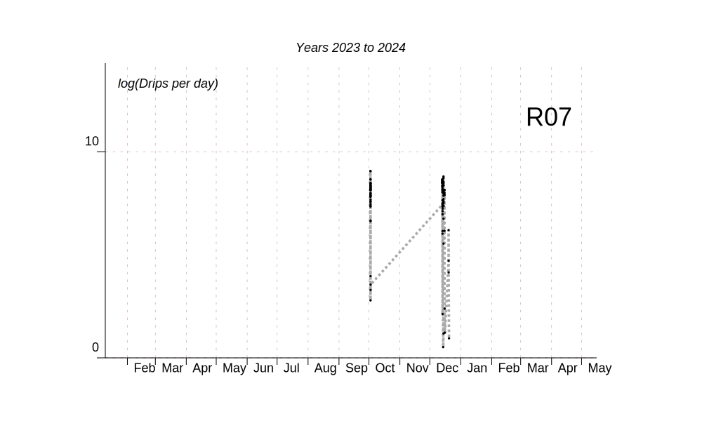
image::out/R04.svg[]
image::out/R03.svg[]
image::out/R01.svg[]

